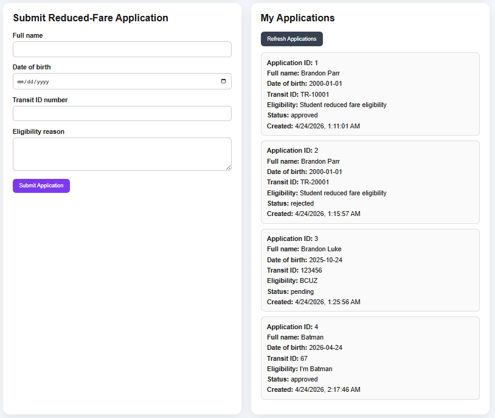
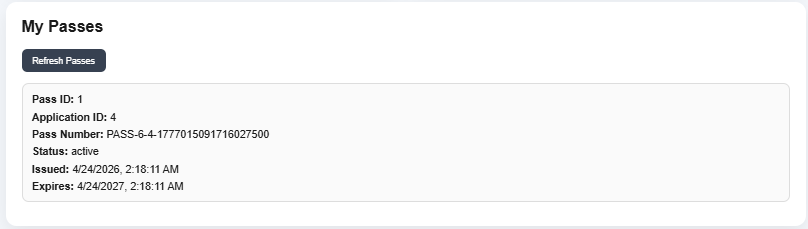

# Reduced-Fare Transit Pass

A full-stack reduced-fare transit pass application built to simulate a government-style identity and eligibility workflow.

This project supports:
- resident registration and login
- reduced-fare application submission
- admin review and approval/rejection
- automatic pass issuance on approval
- resident pass viewing
- admin issued-pass tracking

## Why I built this

I built this project to create a realistic public-sector style workflow application instead of another generic CRUD app. The goal was to build something closer to identity, eligibility, review, and issuance systems used in government and civic software.

## Current workflow

1. A resident registers for an account
2. The resident logs in
3. The resident submits a reduced-fare application
4. An admin reviews the application
5. If approved, the system issues a pass
6. The resident can view their issued pass
7. The admin can view all applications and all issued passes

## Screenshots

### Resident application view


### Admin review queue


### Issued pass view


## Tech stack

### Frontend
- React
- TypeScript
- Vite

### Backend
- Go
- net/http
- pgx

### Database
- PostgreSQL

### Local infrastructure
- Docker
- Docker Compose

## Features implemented

- User registration
- User login
- bcrypt password hashing
- Reduced-fare application submission
- Resident application history
- Admin review queue
- Application approval and rejection
- Automatic pass issuance on approval
- Pass revocation on rejection after issuance
- Resident pass view
- Admin pass tracking

## Project structure

```text
backend/
  cmd/server/
  internal/
    applications/
    auth/
    db/
    passes/
    users/

db/
  init/

docs/
  screenshots/

frontend/
  src/

infra/
  docker/