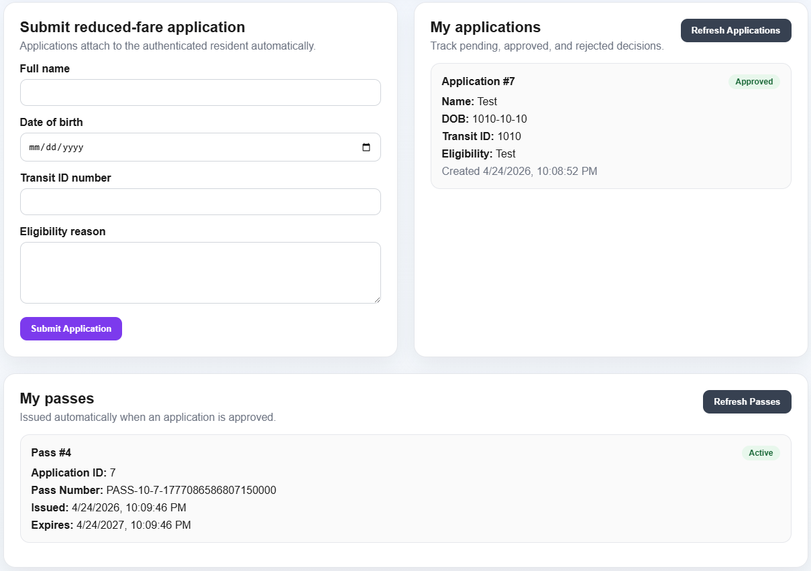
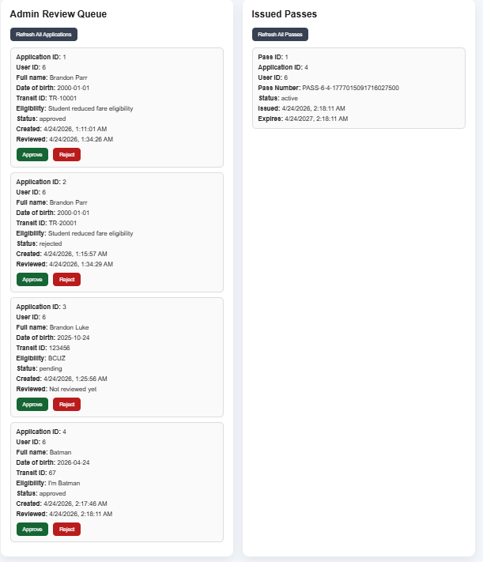
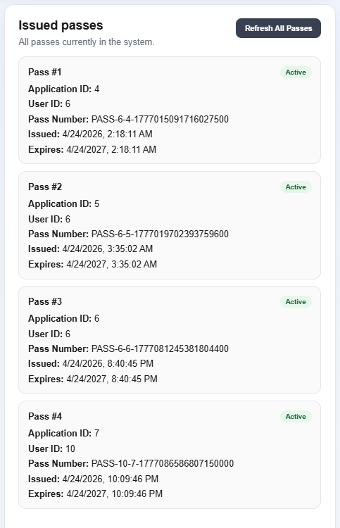
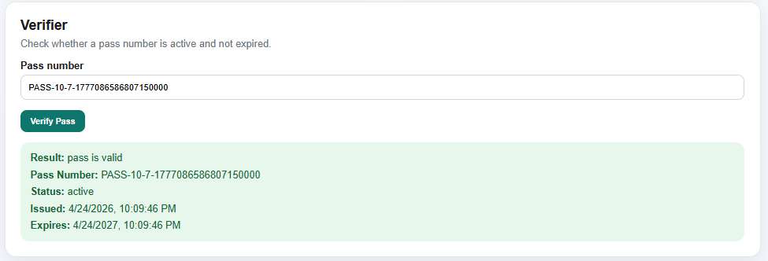

# Reduced-Fare Transit Pass

A full-stack transit eligibility and pass issuance application that simulates a government-style workflow for resident enrollment, admin review, pass issuance, and verifier validation.

## Overview

This project was built to demonstrate a realistic civic-tech workflow instead of another generic CRUD app.

The system supports three roles:

- **Resident**: registers, logs in, submits reduced-fare applications, and views issued passes
- **Admin**: reviews applications, approves or rejects submissions, and manages issued passes
- **Verifier**: validates pass numbers and checks whether a pass is active and unexpired

The app uses server-side session authentication with HTTP-only cookies and role-protected backend routes.

---

## Features

### Resident
- Register and log in
- Submit reduced-fare applications
- View submitted applications and approval status
- View issued transit passes

### Admin
- Review all submitted applications
- Approve or reject applications
- Automatically issue passes on approval
- View all issued passes

### Verifier
- Verify pass validity by pass number
- Confirm whether a pass is active and not expired

### Security / Auth
- Password hashing with bcrypt
- Session authentication with HTTP-only cookies
- Persistent session restore on refresh
- Server-side route protection by role
- Resident identity tied to authenticated session instead of frontend email input

---

## Tech Stack

### Frontend
- React
- TypeScript
- Vite

### Backend
- Go
- `net/http`
- `pgx`

### Database
- PostgreSQL

### Infrastructure
- Docker
- Docker Compose

---

## Architecture

### Frontend
The frontend is a React single-page application that:
- handles login and session restore
- presents role-specific views
- communicates with backend API endpoints
- renders resident, admin, and verifier workflows

### Backend
The Go backend:
- handles authentication and session management
- exposes role-protected API routes
- manages business logic for applications, passes, and verification
- interacts with PostgreSQL for persistent storage

### Database Tables
- `users`
- `applications`
- `passes`
- `sessions`

---

## Core Workflow

1. A resident registers and logs in
2. The resident submits a reduced-fare application
3. An admin reviews the application
4. If approved, the system issues a pass
5. The resident can view the issued pass
6. An admin or verifier can validate the pass number

---

## Screenshots

Add your screenshots to `docs/screenshots/` using the filenames below.

### Resident dashboard


### Admin review queue


### Issued passes


### Verifier panel


---

## Local Setup

### 1. Start PostgreSQL

From the project root:

```powershell
cd infra/docker
docker compose up -d
```

### 2. Start the backend

From the project root:

```powershell
cd backend
go run .\cmd\server\
```

The backend runs at:

```text
http://localhost:8080
```

### 3. Start the frontend

From the project root:

```powershell
cd frontend
npm install
npm run dev
```

The frontend runs at:

```text
http://localhost:5173
```

---

## API Routes

### Public
- `GET /api/health`
- `GET /api/db-health`
- `POST /api/register`
- `POST /api/login`

### Authenticated
- `POST /api/logout`
- `GET /api/me`

### Resident
- `POST /api/applications`
- `GET /api/applications/me`
- `GET /api/passes/me`

### Admin
- `GET /api/admin/applications`
- `POST /api/admin/applications/review`
- `GET /api/admin/passes`

### Verifier / Admin
- `GET /api/verify-pass?pass_number=...`

---

## What This Project Demonstrates

- full-stack application design
- REST API development in Go
- relational database schema design
- role-based authorization
- session authentication with cookies
- password hashing and credential handling
- admin approval workflows
- automatic pass issuance logic
- verifier-facing validation flow
- Docker-based local development setup

---

## Current Limitations

- UI is improved but still not production-grade
- no audit log for who reviewed each application
- no renewal or expiration management workflow beyond stored expiration date
- no file upload or identity document verification
- no automated test suite yet
- no deployment target yet

---

## Future Improvements

- add audit logging for admin review actions
- add pass renewal and revocation management
- add better navigation and role-specific landing pages
- add automated backend and frontend tests
- add deployment configuration
- add document upload / proof-of-eligibility flow
- improve visual design and mobile responsiveness

---

## Repository Structure

```text
backend/
  cmd/server/
  internal/
    applications/
    auth/
    db/
    middleware/
    passes/
    sessions/
    users/

db/
  init/

docs/
  screenshots/

frontend/
  src/

infra/
  docker/
```